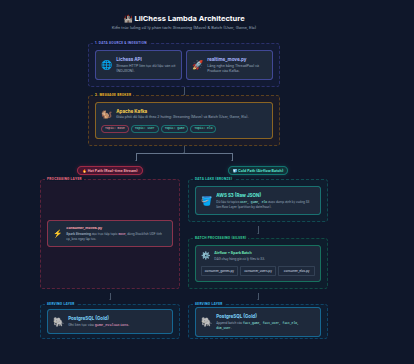

# 🏰 LilChess Data Pipeline


A robust Data Engineering pipeline built using the **Lambda Architecture** to process real-time and batch chess data from the [Lichess API](https://lichess.org/api). This project demonstrates modern data engineering practices including streaming ingestion, data lake storage, batch processing orchestration, and dimensional modeling with table partitioning.

---

## 🏗️ Architecture Blueprint

This project implements a **Lambda Architecture** that separates the data flow into a **Hot Path** (real-time streaming) and a **Cold Path** (batch processing).

<div align="center">
  
</div>

*(Lưu ý: Để ảnh hiển thị ở trên, bạn hãy mở file `blueprint/overall_architecture.html` bằng trình duyệt web, chụp ảnh màn hình giao diện kiến trúc đó và lưu lại với tên `overall_architecture.png` vào trong thư mục `blueprint/` nhé!)*

## 🚀 Key Features

* **Real-time Stream Processing (Hot Path):** Uses **Spark Streaming** to directly consume the `move` topic from **Kafka**. It embeds a Stockfish engine via a Pandas UDF to calculate centipawn loss (`cp_loss`) and detect blunders in real-time, then writes directly to PostgreSQL.
* **Batch Processing (Cold Path):** Less time-sensitive data (`user`, `game`, `elo`) is dumped into **AWS S3** as a Data Lake. **Apache Airflow** schedules hourly batch jobs using **PySpark** to extract, transform, and load (ETL) the data into the Data Warehouse.
* **Data Warehouse (Gold Layer):** Modeled using Dimensional Modeling (Fact & Dimension tables).
* **Table Partitioning:** Implements PostgreSQL `PARTITION BY RANGE` to ensure query performance remains extremely fast as the dataset grows over time.
* **Fault Tolerance:** Because raw data is preserved in AWS S3 (Bronze Layer), the entire PostgreSQL database can be safely rebuilt from scratch if needed without losing historical context.

## 🛠️ Technology Stack

* **Ingestion:** Python (ThreadPoolExecutor, Requests)
* **Message Broker:** Apache Kafka (Confluent)
* **Storage / Data Lake:** AWS S3 (boto3)
* **Data Processing:** Apache Spark (PySpark), Spark Streaming, Pandas UDF
* **Chess Engine:** Stockfish
* **Orchestration:** Apache Airflow
* **Database:** PostgreSQL (psycopg2)
* **Infrastructure:** Docker, Docker Compose

## 🗄️ Database Schema (Gold Layer)

The data is loaded into the `gold` schema in PostgreSQL, categorized into Facts and Dimensions:

- **Fact Tables:**
  - `fact_game`: Metadata about matches (winner, turns, format). Partitioned by Month.
  - `fact_user`: Time-series data of player stats (wins, losses, play time). Partitioned by Month.
  - `fact_elo`: Rating progression over time. Partitioned by Month.
  - `game_evaluations`: Move-by-move real-time Stockfish evaluations (`cp_loss`, `remark`). Partitioned by Day.
- **Dimension Tables:**
  - `dim_user`: Master profile of Lichess players.

## ⚙️ How to Run Locally

1. **Clone the repository:**
   ```bash
   git clone <your-repo-url>
   cd lilchess-pipeline
   ```
2. **Environment Variables:**
   Create a `.env` file in the root directory with your credentials:
   ```env
   # AWS
   AWS_ACCESS_KEY=your_access_key
   AWS_SECRET_KEY=your_secret_key
   region=ap-southeast-1
   bucket_name=your_bucket
   
   # Database
   DB_HOST=localhost
   DB_PORT=5432
   DB_NAME=airflow
   DB_USER=airflow
   DB_PASSWORD=airflow
   
   # Kafka
   KAFKA_BOOTSTRAP_SERVER=your_kafka_broker
   API_KEY=your_kafka_api_key
   API_SECRET=your_kafka_secret
   
   # Stockfish
   STOCKFISH_PATH=/path/to/stockfish
   ```
3. **Start Infrastructure (Airflow, Postgres):**
   ```bash
   docker-compose up -d
   ```
4. **Run the Ingestion Producer:**
   ```bash
   python include/script/raw_data/realtime_move.py
   ```
5. **Run the Spark Streaming Consumer (Hot Path):**
   ```bash
   python include/script/spark/consumer_moves.py
   ```

*(Note: The Airflow scheduler will automatically trigger the Batch jobs for the Cold Path based on the cron schedule `10 * * * *`).*
